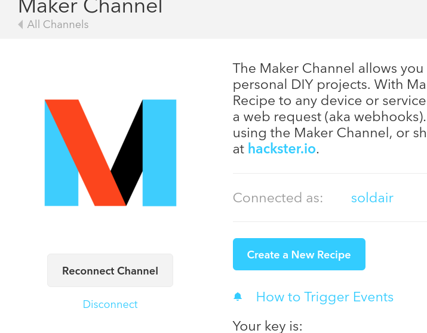
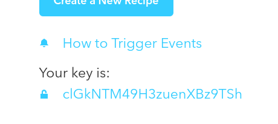
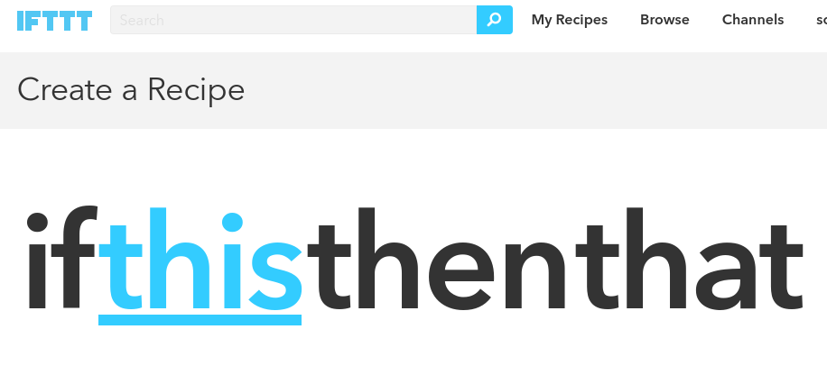
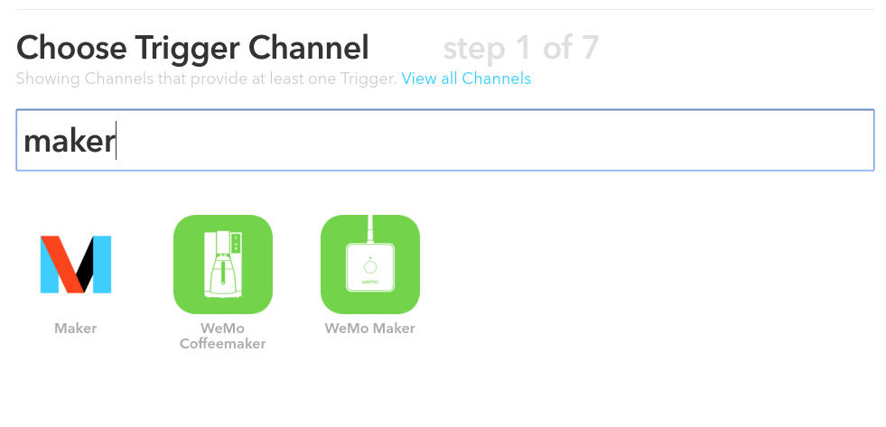
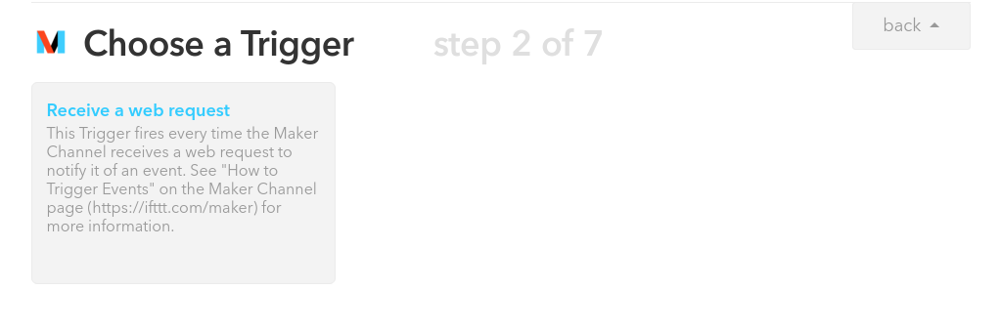
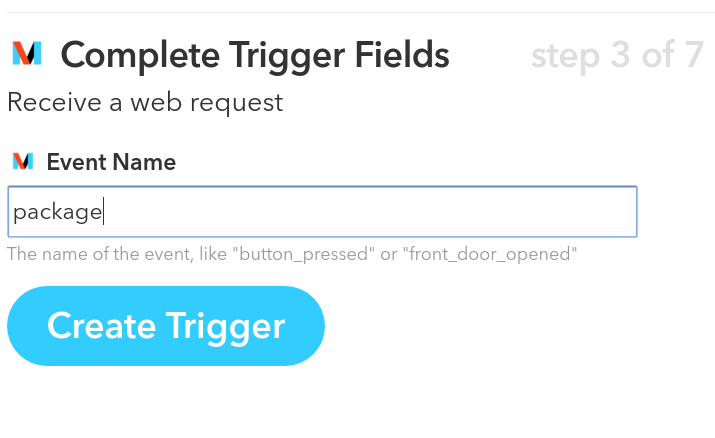
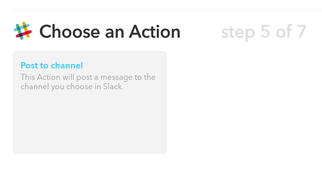
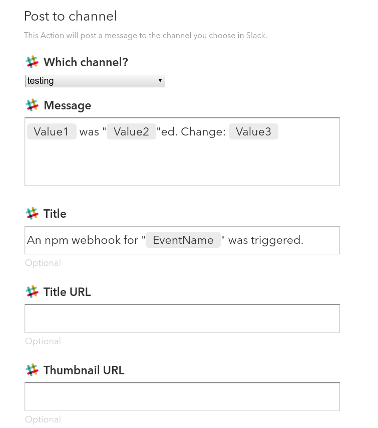

# ifttt-hook-translator
translate webhooks to maker channel iftt requests!!


***   not published to npm yet ***


## setup!

create a new recipe that posts npm webhook changes to your slack!

1. login and create and account on https://ifttt.com

2. visit https://ifttt.com/maker click "connect" button



3. copy your maker key  



4. create the recipe! visit https://ifttt.com/myrecipes/personal/new



5. click "that" and search for "maker". click the M logo



6. click the "Make web request" link



7. fill in "Event Name" field with "package"



8. click "That"

![that](./step5.png}

9. search for "slack". connect to slack. and click "post to channel"



10. fill out the form. 




11. wombat! open your terminal and run 

```
wombat hooks add <your scope orr package> 'http://ifttt.npmjs.com/hooks?makerKey=<your key from step 3>&event=package' a-secret-dores-not-matter
```
